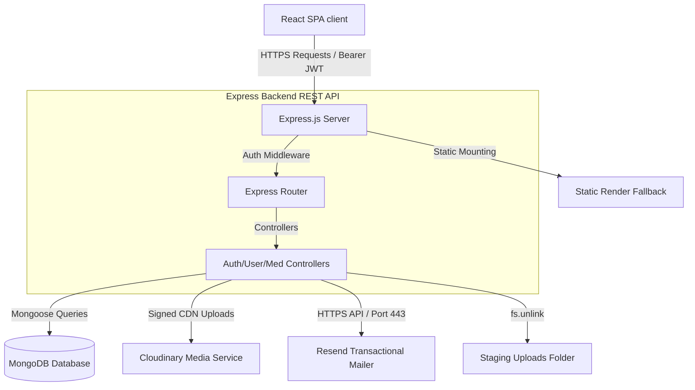

# 🏥 MedEasy Web Platform — Comprehensive Technical System Design & Project Report
### *A Production-Grade Full-Stack Digital Healthcare Portal*

---

## 📄 Document Metadata & Control
*   **Project Title**: MedEasy Digital Healthcare Portal
*   **Version**: 1.0.0
*   **Release Date**: June 18, 2026
*   **Document Classification**: Professional Software Architecture & Design Report
*   **Target Audience**: System Administrators, Full-Stack Developers, DevOps Engineers, Technical Managers
*   **Repository Reference**: [AhsanFayyaz13/MedEasy](https://github.com/AhsanFayyaz13/MedEasy)

---

## 🌐 1. Executive Summary
The **MedEasy Web Platform** is an industry-standard, responsive full-stack digital healthcare ecosystem engineered to bridge the gap between patients, medical practitioners (doctors), pharmacists, and administrators. 

Unlike conventional, simple healthcare apps, MedEasy features **role-based dashboards**, **secure OTP-driven dual-channel registration**, **transactional email integration**, **cloud-hosted CDN media pipelines**, and **tab-isolated multi-session workspaces** enabling developers and stakeholders to test patient and practitioner views simultaneously without session overlaps.

The platform is designed with a decoupled architecture utilizing a React frontend scaffolded with Vite and styled with custom Vanilla CSS, and an Express.js/Node.js backend REST API interacting with a MongoDB database layer through Mongoose schemas. It solves multiple real-world cloud deployment challenges, such as ephemeral storage wipes, SMTP port blocking on cloud providers, and localized data persistence synchronization.

---

## ⚠️ 2. Problem Statement & Design Objectives

### A. The Core Challenges in Digital Healthcare
1.  **Fragmented Workspaces**: Patients, doctors, and pharmacists usually operate in isolated software systems, causing delays in medical validation, prescription verification, and order processing.
2.  **Unverified Registrations & Spam**: Medical apps are highly vulnerable to fake registrations. Verifying identities through OTP while avoiding database bloat is a critical engineering requirement.
3.  **Local Storage Overwrites**: Standard web apps store sessions in `localStorage`. This makes it impossible for developers or QA teams to test interaction between two user roles (e.g., Doctor and Patient) in the same browser, as one session overrides the other.
4.  **Ephemeral File Systems**: Cloud hosting platforms like Render or Railway wipe locally uploaded files (like prescriptions or profile images) whenever a container restarts or redeploys.
5.  **SMTP Port Blockages**: Host environments frequently block ports 25, 465, or 587 to prevent spam, making standard SMTP mailers fail during registration verification.

### B. Engineering Goals of MedEasy
*   **Role-Based Access Control (RBAC)**: Secure pages and endpoints behind custom middlewares separating permissions for Patients, Doctors, Pharmacists, and Admins.
*   **Auto-Cleaning Pending Cache**: Store staging registration details in a temporary database collection that deletes itself if verification is not completed within 15 minutes.
*   **Pakistani Phone Normalization**: Normalize regional phone formats to avoid database duplicate entries.
*   **Tab-Scoped Sessions**: Isolate authorization keys on a per-tab basis using `sessionStorage` while sharing messaging data in `localStorage`.
*   **Zero-Local-Staging Upload Pipeline**: Route uploads directly to a remote Cloudinary CDN, removing local disk dependencies.
*   **SMTP Bypassing Mailer**: Route transactional mail (verification codes, recovery OTPs) over HTTP APIs (Port 443) using Resend.

---

## 🛠️ 3. High-Level System Architecture & Tech Stack

MedEasy uses a modern, decoupled **Model-View-Controller (MVC)** architectural pattern:



### A. Core Technology Stack
*   **Frontend**: React (v19), Vite (v8), Custom Vanilla CSS, React Bootstrap (v2), React Icons, React ChartJS 2 (for dynamic reports).
*   **Backend**: Node.js, Express.js (v5), Multer (file uploads), BcryptJS (encryption), JWT (JSON Web Tokens).
*   **Database**: MongoDB, Mongoose ODM (v9) representing data collections and handling indexing.
*   **Third-Party Gateways**: Cloudinary API (Media CDN), Resend HTTP API (Transactional Emails).

---

## 🗄️ 4. Database Design & Mongoose Schemas

All collections are strictly defined as Mongoose schemas with type safety, validations, default values, and relational references (`ref`).

### A. User Collection (`User` Schema)
Stores profile credentials and metadata. Roles define the access levels of the user.

| Field Name | Type | Constraints | Description |
| :--- | :--- | :--- | :--- |
| `name` | `String` | Required | Full name of the user |
| `email` | `String` | Unique, Sparse | Mandatory for practitioners; unique index |
| `phone` | `String` | Unique, Required | Primary identity key (Normalized format) |
| `password` | `String` | Required | Hashed via bcrypt (10 salt rounds) |
| `role` | `String` | Enum: `patient`, `pharmacist`, `doctor`, `admin` | Access control role |
| `profileImage` | `String` | Optional | Secure URL returned by Cloudinary CDN |
| `isVerifiedProfile`| `Boolean`| Default: `false` | Verification approval flag for practitioners |
| `degreeName` | `String` | Optional (Pharmacist only) | Professional degree (e.g. Pharm.D) |
| `licenseNumber` | `String` | Optional (Pharmacist only) | Pharmacy Council License |
| `specialty` | `String` | Optional (Doctor only) | Medical specialization |
| `pmcRegistration` | `String` | Optional (Doctor only) | PMC Registration License |
| `consultationFee` | `Number` | Optional (Doctor only) | Cost per appointment session in PKR |
| `availableDays` | `[String]`| Default: `[]` | Practice schedule days |

### B. Pending Registration Collection (`PendingUser` Schema)
Holds unverified registrations. If the verification is not completed within 15 minutes, the record is automatically purged.

| Field Name | Type | Constraints | Description |
| :--- | :--- | :--- | :--- |
| `name` / `password` | `String` | Required | Registrant details |
| `phone` / `email` | `String` | Required | Contact details for OTP routing |
| `verificationCode` | `String` | Required | 6-digit verification code |
| `verificationCodeExpires` | `Date` | Required | Expiration threshold of current OTP |
| `createdAt` | `Date` | Default: `Date.now`, **Expires: 900** | **Mongoose TTL Index** (Purges document after 900s) |

### C. Medicine Collection (`Medicine` Schema)
Manages pharmacy stocks and pricing.

| Field Name | Type | Constraints | Description |
| :--- | :--- | :--- | :--- |
| `name` | `String` | Required | Name of the medicine |
| `category` | `String` | Required | Drug category (e.g., Antibiotic, Analgesic) |
| `description` | `String` | Required | Usage and dosing instructions |
| `price` | `Number` | Required | Selling price in PKR |
| `stock` | `Number` | Required, Default: `0` | Quantity currently in stock |
| `requiresPrescription`| `Boolean`| Default: `false` | Blocks checkout unless verified prescription is uploaded |
| `imageUrl` | `String` | Optional | Cloudinary HTTPS link or local static fallback |

### D. Appointment Collection (`Appointment` Schema)
Connects patients with doctors for clinical consultations.

| Field Name | Type | Constraints | Description |
| :--- | :--- | :--- | :--- |
| `patientId` | `ObjectId` | Required, Ref: `User` | Patient reference |
| `doctorId` | `ObjectId` | Required, Ref: `User` | Doctor reference |
| `date` / `time` | `Date` / `String`| Required | Consultation date and slot time |
| `status` | `String` | Enum: `scheduled`, `completed`, `cancelled` | Live booking status |
| `consultationNotes`| `String` | Optional | Notes written by doctor during checkup |
| `prescription` | `String` | Optional | Doctor's digital prescription notes |

### E. Order Collection (`Order` Schema)
Manages commerce transactions.

| Field Name | Type | Constraints | Description |
| :--- | :--- | :--- | :--- |
| `userId` | `ObjectId` | Required, Ref: `User` | Patient placing the order |
| `items` | `Array` | Required | Contains `{ medicineId, quantity, price }` |
| `totalAmount` | `Number` | Required | Total amount paid |
| `status` | `String` | Enum: `pending`, `confirmed`, `delivered`... | Order dispatch status |
| `shippingAddress` | `Object` | Required | Direct address and contact number details |

---

## ⚡ 5. Advanced Engineering Highlights & Code Deep Dives

### A. Mongoose Time-To-Live (TTL) Indexing
To prevent the database from piling up unverified spam accounts, MedEasy registers new users into a `PendingUser` collection first. If they do not verify their OTP within 15 minutes, MongoDB automatically deletes the record using a background worker thread checking a TTL index.

*Backend Schema Configuration (`backend/models/PendingUser.js`):*
```javascript
const pendingUserSchema = new mongoose.Schema({
  name: { type: String, required: true },
  phone: { type: String, required: true },
  email: { type: String },
  password: { type: String, required: true },
  role: { type: String, required: true },
  verificationCode: { type: String, required: true },
  createdAt: { 
    type: Date, 
    default: Date.now, 
    expires: 900 // 900 seconds = 15 minutes
  }
});
```

### B. Pakistani Phone Number Normalization
To prevent registration bypasses (e.g., registering the same number as `03001234567`, `+923001234567`, or `3001234567`), a custom normalizer standardizes all incoming strings to `923xxxxxxxxx` format.

*Utility Logic (`backend/utils/phone.js`):*
```javascript
function normalizePhone(value) {
  if (!value || typeof value !== 'string') return null;

  let digits = value.trim().replace(/[\s()-]/g, '');

  if (digits.startsWith('+')) digits = digits.slice(1);
  if (digits.startsWith('00')) digits = digits.slice(2);

  // Convert local 03xxxxxxxxx to 923xxxxxxxxx
  if (/^0\d{10}$/.test(digits)) {
    digits = '92' + digits.slice(1);
  }

  // Convert 3xxxxxxxxx to 923xxxxxxxxx
  if (/^3\d{9}$/.test(digits)) {
    digits = '92' + digits;
  }

  if (/^92\d{10}$/.test(digits)) {
    return digits;
  }
  return digits;
}
```

### C. Tab-Isolated Authentication & Shared Communication
Standard full-stack projects use `localStorage` to save JWT tokens. However, this causes session collisions: logging in as a Doctor in one tab logs out the Patient in another tab. MedEasy fixes this using two decoupled scopes:
1.  **Auth Isolation**: Token storage uses `sessionStorage`. Each browser tab holds its own separate login credentials, allowing developers and QA to test interactions in real-time.
2.  **Shared Messaging**: Database collections like live clinical chat logs (`medeasy_chats`) and client-side notifications/reports are stored in `localStorage` so that different user tabs can instantly see updates and send messages to each other.

### D. Zero-Local-Staging Media Pipeline
To support hosting on ephemeral platforms like Render, the uploads system intercepts standard multi-part file payloads using `multer`, posts them directly to the Cloudinary CDN via the Node SDK, and purges the temporary local file asynchronously using `fs.unlink`.

*Upload Controller Logic (`backend/controllers/uploadController.js`):*
```javascript
const cloudinary = require('cloudinary').v2;
const fs = require('fs');

exports.uploadMedia = async (req, res) => {
  try {
    if (!req.file) {
      return res.status(400).json({ message: 'No file uploaded' });
    }

    // Upload to Cloudinary CDN
    const result = await cloudinary.uploader.upload(req.file.path, {
      folder: 'medeasy_uploads',
      resource_type: 'auto',
    });

    // Asynchronously delete the temporary local file
    fs.unlink(req.file.path, (err) => {
      if (err) console.error('Error clearing local file staging:', err);
    });

    return res.status(200).json({
      message: 'Upload successful',
      url: result.secure_url
    });
  } catch (error) {
    // Make sure to clean up the local file even if the CDN upload fails
    if (req.file) {
      fs.unlink(req.file.path, () => {});
    }
    return res.status(500).json({ message: error.message });
  }
};
```

### E. Render Ephemeral Static Media Fallback
To keep default catalog images loading even after Render redeployments, the server uses a secondary static directory mapping strategy.
```javascript
// Mount uploads folder (for temporary staging)
app.use('/uploads', express.static(path.join(__dirname, 'uploads')));
// Mount static folder (holds hardcoded medicine seed packaging art)
app.use('/uploads', express.static(path.join(__dirname, 'static')));
```
If an image request for `/uploads/panadol.jpg` fails in the empty uploads folder, Express automatically looks inside the static assets folder and serves the pre-seeded catalog packaging.

---

## 🔒 6. Security Architecture & Role-Based Access Control (RBAC)

MedEasy secures user data and APIs through multiple layers of server and client validation:

1.  **Password Encryption**: Safe password storage is handled by `bcryptjs` with 10 salt rounds:
    ```javascript
    const salt = await bcrypt.genSalt(10);
    user.password = await bcrypt.hash(rawPassword, salt);
    ```
2.  **Stateless JWT Authorization**: API requests are verified through a Bearer Token header inside `auth.js` middleware:
    ```javascript
    const token = req.headers.authorization?.split(' ')[1];
    const decoded = jwt.verify(token, process.env.JWT_SECRET);
    req.user = decoded; // holds id, role, name
    ```
3.  **Role Transformation Middleware**:
    For backwards compatibility and vendor representation, a `pharmacy` role is parsed and transformed into a `pharmacist` clearance level if the account is verified by administrators, ensuring access to apothecary inventories.
4.  **Cart Guardrails**:
    React's context state intercepts cart adds: if a user is not authenticated, they cannot add medicines. A glassmorphic login modal pops up, saving their item selections and restoring them upon successful authorization.

---

## 🔌 7. REST API Endpoint Specifications

All endpoints communicate via JSON. Protected routes require `Authorization: Bearer <token>`.

### A. Authentication & Profiles (`/api/auth`)
*   `POST /api/auth/register`: Staged registration. Generates and sends OTP.
*   `POST /api/auth/verify-registration`: Matches OTP, hashes password, saves to active collections, returns JWT.
*   `POST /api/auth/login`: Authenticates phone & password. Returns JWT and user profile.
*   `GET /api/auth/profile` *(Protected)*: Returns the authenticated user's profile document.

### B. Practitioner & Admin Operations (`/api/admin`)
*   `GET /api/admin/users/pending` *(Admin Only)*: Returns doctor/pharmacist profiles awaiting license verification.
*   `PUT /api/admin/users/:id/approve` *(Admin Only)*: Set practitioner profile `isVerifiedProfile = true`.

### D. Catalog, Appointments & Orders
*   `GET /api/medicines`: Lists medicine catalog (supports search queries).
*   `POST /api/medicines` *(Practitioner/Admin Only)*: Inserts a new medicine item into the catalog.
*   `POST /api/appointments/book` *(Patient Only)*: Books a slot with a doctor.
*   `GET /api/appointments` *(Protected)*: Lists booked sessions (filtered automatically by current patient/doctor).
*   `POST /api/orders` *(Patient Only)*: Places an order for medicines. If checkout contains items marked `requiresPrescription: true`, the API validates that a prescription document has been uploaded.

---

## 🛠️ 8. Local Setup & DevOps Configurations

### A. Backend Environment Templates (`backend/.env`)
```ini
PORT=5000
MONGO_URI=mongodb://localhost:27017/medeasy
JWT_SECRET=super_secure_jwt_secret_key_1234
FRONTEND_ORIGIN=http://localhost:5173,http://localhost:5174
MAX_UPLOAD_BYTES=5242880

# Resend Transactional Email Setup
RESEND_API_KEY=re_your_resend_api_key
SENDER_EMAIL=medeasy@medeasy.systems

# Cloudinary CDN Configuration
CLOUDINARY_CLOUD_NAME=your_cloudinary_cloud_name
CLOUDINARY_API_KEY=your_cloudinary_api_key
CLOUDINARY_API_SECRET=your_cloudinary_api_secret
```

### B. Single-Command Startup
To run the server locally without launching multiple terminals, the root uses `concurrently` scripts:
```powershell
# Install all backend & frontend dependencies in one go
npm run install-all

# Seed initial admin, doctor, pharmacist, and medicine lists
cd backend
npm run seed

# Run both React Dev Server and Node.js REST API server simultaneously
cd ..
npm run start
```

---

## 🔮 9. Future Roadmap & Project Limitations

While the current version of MedEasy is a fully functional MVP, the following features are planned for future releases:
1.  **Production Payment Gateway**: Replace cash-on-delivery and mock payment states with real payment processors like Stripe or local integrations (JazzCash/EasyPaisa).
2.  **SMS Gateway Integration**: Integrate an SMS service (e.g., Twilio or local providers) to send verification OTPs directly to users' phones, matching the mock console functionality.
3.  **Real-Time Video Consultations**: Integrate WebRTC or Zoom Developer SDKs directly into the Doctor-Patient appointment workspace to support virtual checkups.
4.  **AI Prescription Parser**: Integrate OCR and Gemini API models to scan uploaded prescription images, extract medicine names, and automatically add them to the patient's cart.
