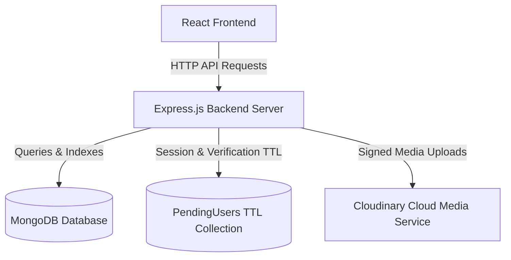
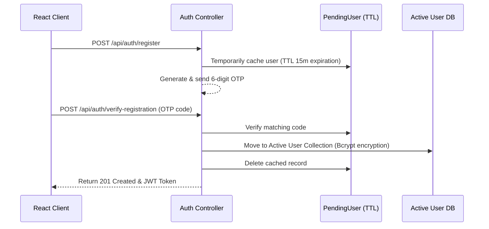

# 🏥 MedEasy — Full-Stack Digital Healthcare Portal

[](https://nodejs.org/)
[](https://react.dev/)
[](https://vitejs.dev/)
[](https://www.mongodb.com/)
[](https://resend.com/)
[](LICENSE)

**MedEasy** is a state-of-the-art, responsive full-stack web platform designed to streamline digital healthcare. Featuring role-based dashboards, secure dynamic registrations, transactional communication systems, and interactive catalog systems, MedEasy provides a premium portal for patients, doctors, pharmacists, and administrators.

---

## 🛠️ Architecture & System Design

MedEasy uses a modern decoupled architecture:
*   **Frontend**: React client scaffolded with Vite, featuring dynamic custom Vanilla CSS, React Bootstrap, React Icons, and interactive Chart.js dashboards.
*   **Backend**: Node.js + Express.js API engine interfacing with MongoDB through Mongoose schemas.
*   **Media Hosting (Cloudinary)**: Integrated Cloudinary API for secure signed uploads of prescriptions, avatars, and medicine graphics, eliminating local storage dependencies and DB blob size issues.
*   **Authentication**: JSON Web Token (JWT) session authorization, secure bcrypt hashing, and tab-isolated sessionStorage persistence (enabling multiple active sessions in different tabs).



---

## 🌟 Key Features

### 🔒 Registration & OTP Verification Workspace
*   **Dual-Channel Delivery**: Users can request verification codes via `email` or `phone`.
*   **Mongoose TTL Indexing**: Unverified registration requests are written to a temporary `PendingUser` collection with a **15-minute Time-To-Live (TTL) index**. Accounts not verified within 15 minutes are automatically purged by MongoDB background processes to keep databases clutter-free.
*   **Pakistani Phone Normalization**: Input formats (e.g., `03001234567`, `+923001234567`, or `3001234567`) are automatically normalized to standard database-compatible country format (`923001234567`).



### 🔒 Tab-Isolated Multi-Session Authentication
*   **Tab-Level Auth Scoping**: JWT authentication tokens and active user profile details are stored in tab-scoped `sessionStorage`. This isolates sessions, enabling you to login as different users (e.g. Patient on one tab and Doctor/Pharmacist on another) simultaneously without logging each other out.
*   **Cross-Tab E2E Communication**: Mock database resources like clinical chat rooms (`medeasy_chats`) and client-side notifications/reports remain in shared `localStorage` so that independent browser tab sessions can interact with each other in real-time.

### 📧 Transactional Mail Engine
*   **Resend HTTP API Integration**: Emails (OTPs and password recovery codes) are dispatched via Resend's HTTPS API over Port 443. This bypasses common SMTP port-blocking policies enforced by hosts like Render Free.
*   **Diagnostic Fallback**: When `RESEND_API_KEY` is not present (for local testing), emails gracefully execute a diagnostic fallback printing OTP verification details directly to the backend terminal.

### 🛒 Session Cart Guardrails & Synchronization
*   **Login-Required Checkout Prompt**: Unauthenticated guest users are blocked from adding items to carts. Instead, a glassmorphic modal prompts them to login/register, maintaining their in-progress selections seamlessly.
*   **Session Purge Observer**: If the user's JWT session expires or they trigger a manual logout, local storage cart caches are instantly cleared to avoid state cross-contamination.

### ⚡ Interactive Multi-Role Dashboards
*   **Personalized Greeting Engine**: Custom greetings display the authenticated user's actual registered name dynamically, falling back securely to role titles if undefined.
*   **Active Tab Query Sync**: URL query parameter states (e.g. `?tab=users`) synchronize dynamically inside dashboards using `useLocation()`, preventing full page reloads.
*   **Admin Sidebar Navigation Filters**: Custom `hiddenFromSidebar` properties filter utility views out of side navigation drawers to keep dashboards clean.
*   **Top Navbar Active Highlights**: Navbar icons display active indicators specifically matched against URL paths and queries, falling back to standard text highlights on hover.
*   **Pakistani Date Engine**: Localized appointment dates use tailored utility functions matching the local region.
*   **Brand Reload Workspace**: Clicking the logo triggers a full memory reload (`window.location.href`) resetting dashboards fresh.

### 🖼️ Cloudinary CDN Integration
*   **Zero-Local-Staging Media Pipeline**: Image and file uploads are dispatched directly to Cloudinary using signed upload signatures.
*   **Automatic Disk Cleaning**: Backend temporary files are automatically unlinked upon upload resolution to keep Render/Railway ephemeral container storage clean.

### 📁 Render Ephemeral Media Fallback
*   **Double Static Resolutions**: Static mock/seed medicine packaging images are mounted using secondary fallback lookups in `backend/static/` under the `/uploads` virtual path, keeping catalog images alive on ephemeral host platforms.

---

## 📁 Repository Directory Structure

```
MedEasy/
├── backend/                   # Express.js REST API Server
│   ├── controllers/           # Auth, User, and Business Controllers
│   ├── models/                # Mongoose Schemas (User, PendingUser, Medicine...)
│   ├── routes/                # Express Route Handlers
│   ├── static/                # Pre-seeded medicine images (Render fallback)
│   ├── utils/                 # Utilities (mailer.js, phone.js, cloudinary.js)
│   └── uploads/               # Local prescription and profile photo uploads
├── frontend/                  # React client build (Vite framework)
│   ├── src/
│   │   ├── components/        # Modals, Navbar, and Reusable Components
│   │   ├── context/           # Global State Providers (Auth, Cart, Modals...)
│   │   ├── pages/             # Doctor, Pharmacist, Admin, Team, and User Views
│   │   └── main.jsx           # Entrypoint and routes
│   └── package.json           # Client dependency configurations
├── package.json               # root configurations & concurrently startup scripts
└── system_documentation.md    # High-fidelity architectural breakdown
```

---

## 🚀 Local Setup & Configuration

### 1. Prerequisites
Ensure you have the following installed on your system:
*   [Node.js](https://nodejs.org/) (v18.x or higher)
*   [MongoDB Community Server](https://www.mongodb.com/try/download/community) (running locally on port `27017`)

---

### 2. Configure Environment Variables

#### Backend Configuration
Copy the template env file:
```powershell
copy backend\.env.example backend\.env
```
Open `backend/.env` and update the properties:
```ini
MONGO_URI=mongodb://localhost:27017/medeasy
JWT_SECRET=your_super_secure_jwt_secret_key
FRONTEND_ORIGIN=http://localhost:5173,http://localhost:5174
MAX_UPLOAD_BYTES=5242880

# Resend Transactional Email Setup (HTTP API)
RESEND_API_KEY=your_resend_api_key_here
SENDER_EMAIL=medeasy@medeasy.systems

# Cloudinary CDN Configuration
CLOUDINARY_CLOUD_NAME=your_cloudinary_cloud_name
CLOUDINARY_API_KEY=your_cloudinary_api_key
CLOUDINARY_API_SECRET=your_cloudinary_api_secret
```

#### Frontend Configuration (Optional)
If required, configure a `.env` file in the `frontend` folder:
```ini
VITE_API_BASE_URL=http://localhost:5000/api
```

---

### 3. Installation & Database Seeding

From the repository root, install dependencies for both the frontend and backend:
```powershell
npm run install-all
```

Seed the database with sample medicines and user credentials:
```powershell
cd backend
npm run seed
```

---

### 4. Running the Application

You can launch both services concurrently with a single command from the repository root:
```powershell
npm run start
```
*   **React Frontend** starts on `http://localhost:5173` (Vite)
*   **Express Backend** starts on `http://localhost:5000`

> **Note**: Alternatively, you can start the backend individually using `npm run start-backend` and frontend using `npm run start-frontend`.

#### Health Verification
Verify that your API server is running correctly:
*   Endpoint: `GET http://localhost:5000/api/health`
*   Expected Output: `{ "status": "ok", "timestamp": 1234567890000 }`

---

## 👥 Seed User Credentials

Use the following pre-seeded users to audit the system's role-based permissions:

| Role | Email | Password | Access Level |
| :--- | :--- | :--- | :--- |
| **Administrator** | `admin@medeasy.local` | `AdminPass123` | Global Auditing, Verification Approvals, User Lists |
| **Doctor** | `doctor@medeasy.local` | `DoctorPass123` | Patient Prescriptions, Dashboard Diagnostics |
| **Pharmacist** | `pharm@medeasy.local` | `PharmPass123` | Medicine Stocks, Apothecary Sales Dashboard |
| **Patient** | `patient@medeasy.local` | `PatientPass123` | Medicine Shop, Prescription Uploads, Cart checkout |

---

## 🌐 Production Deployment Guide

*   **Backend**: Deploy to services like **Render** or **Railway**. 
    *   *Tip*: Make sure to expose the variables `MONGO_URI`, `JWT_SECRET`, `RESEND_API_KEY`, and `SENDER_EMAIL` in the environment settings on your host dashboard.
*   **Frontend**: Build the distribution bundle using `npm run build` and deploy static assets to **Vercel**, **Netlify**, or **GitHub Pages**. Set the `VITE_API_BASE_URL` to point to your live backend domain.
