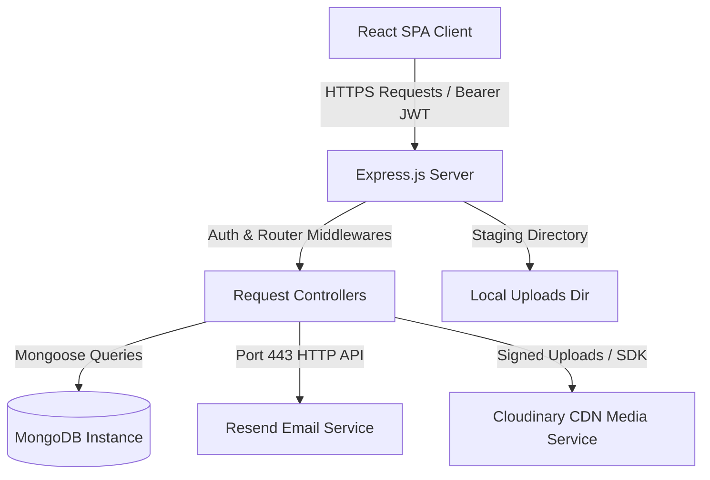
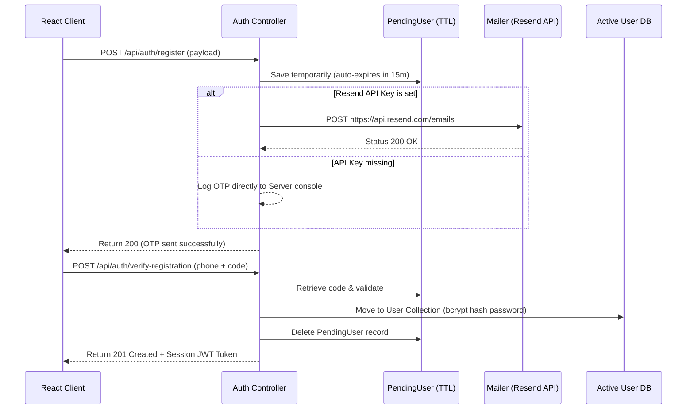

# 🏥 MedEasy Web Platform — Production-Grade Technical & System Architecture Specification

This document provides a comprehensive, industry-standard technical overview of the **MedEasy Web Platform** codebase. It outlines the architecture, data models, state flows, security measures, and API specifications of the application.

---

## 📄 1. Document Control & Metadata

*   **Title**: MedEasy Technical & System Architecture Specification
*   **Version**: 1.1.0
*   **Date**: June 4, 2026
*   **Status**: Approved
*   **Target Audience**: Systems Engineers, Security Architects, Full-Stack Developers, Database Administrators
*   **Document Purpose**: To serve as the definitive system design blueprint and integration handbook for developers and system auditors.

---

## 🛠️ 2. Architectural & System Design Overview

MedEasy is built on a **decoupled client-server architecture**:
1.  **Frontend Web Client**: A Single Page Application (SPA) built using React (Vite), styled with dynamic custom Vanilla CSS, utilizing React Bootstrap components, React Icons, and Chart.js dashboards.
2.  **Backend REST API**: A stateless Node.js Express server handling business logic, authentication middleware, uploads validation, and transaction pipelines.
3.  **Database Layer**: MongoDB Document Store, managed through Mongoose Object-Document Mapping (ODM) schemas.
4.  **Media Storage Gateway (Cloudinary CDN)**: Integrates the Cloudinary Node SDK to process signed uploads of user profile images, pharmacist documentation, medicine packaging art, and patient prescription files, bypassing local virtual disk volumes.



---

## 🗄️ 3. Database Architecture & Data Models

All MongoDB collections are mapped to Mongoose schemas. Database schemas enforce type safety, validation rules, default configurations, and indexing.

### A. User Schema (`User` Collection)
Stores profile credentials and meta-data for all actors: Patients, Doctors, Pharmacists, Administrators, and Pharmacies.

| Field Name | Data Type | Validation / Constraints | Description |
| :--- | :--- | :--- | :--- |
| `name` | `String` | Required | Registered full name of the user |
| `email` | `String` | Unique, Sparse | Optional, must be unique if provided |
| `phone` | `String` | Unique, Required | Primary identifier (Normalized Pakistani format) |
| `password` | `String` | Required | Hashed credentials (bcrypt, salt rounds = 10) |
| `role` | `String` | Enum: `patient`, `pharmacist`, `doctor`, `admin`, `pharmacy` | Default: `patient`. Defines RBAC rights |
| `profileImage` | `String` | Optional | Remote Cloudinary CDN URL (`https://res.cloudinary.com/...`) |
| `address` | `String` | Optional | General mailing address |
| `isVerifiedProfile`| `Boolean`| Default: `false` | Admin-verified flag for doctor/pharmacist profiles |
| `pharmacyName` | `String` | Optional (Pharmacy/Pharmacist only) | Commercial pharmacy organization name |
| `pharmacyLocation` | `String` | Optional (Pharmacy/Pharmacist only) | Geo-location or street address of the pharmacy |
| `degreeName` | `String` | Optional (Pharmacist only) | Professional degree (e.g. Pharm.D, B.Pharm) |
| `licenseNumber` | `String` | Optional (Pharmacist only) | Pharmacy Council Registration number |
| `pharmacistDetails`| `Object` | Optional nested object | Active representative pharmacist profile (Admin audited) |
| `specialty` | `String` | Optional (Doctor only) | Medical specialization (e.g., Cardiologist) |
| `pmcRegistration` | `String` | Optional (Doctor only) | PMC / PMDC Registration License number |
| `experience` | `Number` | Optional (Doctor only) | Number of active years of practice |
| `consultationFee` | `Number` | Optional (Doctor only) | Pricing per session in Pakistani Rupees (PKR) |
| `availableDays` | `[String]`| Default: `[]` | Schedule days (e.g. `['Monday', 'Wednesday']`) |
| `resetPasswordCode`| `String`| Optional | 6-digit numeric recovery code |
| `resetPasswordExpires`| `Date` | Optional | Expiration timestamp for reset code |

### B. PendingUser Schema (`PendingUser` Collection)
Holds cached registrant data temporarily during the verification process. Uses MongoDB TTL index for automatic expiration.

| Field Name | Data Type | Constraints | Description |
| :--- | :--- | :--- | :--- |
| `name` / `password` | `String` | Required | Registration credentials |
| `phone` | `String` | Required | Target phone number for OTP |
| `email` | `String` | Optional | Target email address |
| `role` | `String` | Enum: `patient`, `pharmacist`, `doctor`, `admin` | Default: `patient` |
| `verificationCode` | `String` | Required | 6-digit verification OTP |
| `verificationCodeExpires`| `Date` | Required | OTP validation limit (usually 15m) |
| `verificationChannel`| `String` | Enum: `email`, `phone` | Path utilized for sending OTP |
| `createdAt` | `Date` | Default: `Date.now`, **Expires: 900** | **TTL Index**: Document deleted automatically after 15m |

### C. Medicine Schema (`Medicine` Collection)
Defines catalog inventory records.

| Field Name | Data Type | Constraints | Description |
| :--- | :--- | :--- | :--- |
| `name` / `category` | `String` | Required | Name and category of drug (e.g., Antibiotic) |
| `description` | `String` | Required | Detailed usage guidelines |
| `price` | `Number` | Required | Selling price in PKR |
| `stock` | `Number` | Required, Default: `0` | Available stock count |
| `requiresPrescription`| `Boolean`| Default: `false` | If true, checkout requires uploading a prescription |
| `imageUrl` | `String` | Optional | Cloudinary CDN URL or local static fallback path |

### D. Appointment Schema (`Appointment` Collection)
Enables booking transactions between Patients and Doctors.

| Field Name | Data Type | Constraints | Description |
| :--- | :--- | :--- | :--- |
| `patientId` | `ObjectId` | Required, Ref: `User` | The patient booking the session |
| `doctorId` | `ObjectId` | Required, Ref: `User` | The target medical professional |
| `date` / `time` | `Date` / `String`| Required | Date and session time slot |
| `status` | `String` | Enum: `scheduled`, `completed`, `cancelled` | Default: `scheduled` |
| `consultationNotes`| `String` | Optional | Summary provided by the doctor |
| `prescription` | `String` | Optional | Prescribed medicines/dosage notes |

### E. Order Schema (`Order` Collection)
Tracks pharmacy purchases.

| Field Name | Data Type | Constraints | Description |
| :--- | :--- | :--- | :--- |
| `userId` | `ObjectId` | Required, Ref: `User` | The patient placing the order |
| `items` | `Array` | Required | Array containing `{ medicineId, quantity, price }` |
| `prescriptionId` | `ObjectId` | Optional, Ref: `Prescription` | Verified prescription verification reference |
| `totalAmount` | `Number` | Required | Total checkout price |
| `status` | `String` | Enum: `pending`, `confirmed`, `processing`, `dispatched`, `delivered`, `cancelled` | Default: `pending` |
| `paymentStatus` | `String` | Enum: `pending`, `paid`, `refunded` | Default: `pending` |
| `shippingAddress` | `Object` | Required nested fields | Delivery destination contact and address details |

### F. Prescription Schema (`Prescription` Collection)
Defines user-submitted files validating prescription-only medicine orders.

| Field Name | Data Type | Constraints | Description |
| :--- | :--- | :--- | :--- |
| `userId` | `ObjectId` | Required, Ref: `User` | Owner of the prescription |
| `doctorId` | `ObjectId` | Optional, Ref: `User` | The prescribing physician |
| `fileUrl` | `String` | Required | Remote Cloudinary CDN URL (`https://res.cloudinary.com/...`) |
| `status` | `String` | Enum: `pending`, `verified`, `rejected` | Default: `pending`. Audited by Pharmacists |

---

## 🔒 4. Registration, Security & Verification Engine

To maintain system integrity and prevent unauthorized spam accounts, MedEasy utilizes a strict dual-stage registration flow.

### A. The Verification Database & OTP Sequence

1.  **Staging Phase**: User posts credentials to `/api/auth/register`. A 6-digit numerical OTP is generated and the user record is written to `PendingUser` collection (marked with an automatic 15-minute TTL expiration index).
2.  **Dispatch Phase**: The OTP is sent dynamically using the preferred channel:
    *   **Email Channel**: Routed via the **Resend HTTP API** (port 443) using the `RESEND_API_KEY` token.
    *   **SMS/Phone Channel**: Simulates delivery, writing the notification to the backend terminal log.
    *   **Fallback Strategy**: If `RESEND_API_KEY` is not present, email dispatches fallback to console terminal logging.
3.  **Activation Phase**: The user submits the code to `/api/auth/verify-registration`. The system matches the OTP, deletes the `PendingUser` record, hashes the password using bcrypt, and creates a permanent record in the `User` collection.



### B. Pakistani Phone Number Normalization
Contact numbers in Pakistan are standardized using `backend/utils/phone.js` to prevent database duplicate states:
*   Converts `03xxxxxxxxx` or `+923xxxxxxxxx` or `3xxxxxxxxx` formats into a clean `923xxxxxxxxx` string (exactly 12 digits, starting with `923`).
*   Returns `null` if the input is malformed.

### C. Authentication & Session Security Guardrails
*   **JWT Architecture & Tab-Isolated Multi-Session Persistence**: Sessions use JWT tokens signed with a secret hash (`JWT_SECRET`). Tokens (`medeasy_access_token`, `medeasy_refresh_token`, `medeasy_user`) are persisted in the browser's tab-scoped `sessionStorage`. This isolates user sessions on a per-tab basis, allowing a user to run separate active sessions concurrently (e.g. logging in as a Doctor in one tab and as a Patient in another) without cross-tab session pollution.
*   **Role Transformation Middleware**:
    If a `pharmacy` user logs in, the auth middleware (`backend/middleware/auth.js`) transparently maps the role alias to `pharmacist` for route authorization if a valid `pharmacistDetails` representative is bound to the account.
*   **Login-Required Checkout Prompt**: Unauthenticated guest users are blocked from adding items to a checkout cart. Instead, the `LoginRequiredModal.jsx` intercepts the request and redirects them to the signup page while preserving catalog state.
*   **Session Purge Observer**: A React `useEffect` inside `CartContext.jsx` monitors the authentication state. If the user logs out or the token expires, the shopping cart is instantly cleared:
    ```javascript
    useEffect(() => {
      if (!isAuthenticated) {
        setCartItems([]);
      }
    }, [isAuthenticated]);
    ```

### D. Cloudinary CDN Media Upload Pipeline
To optimize delivery and ensure persistent image hosting across container restarts (e.g. on Render):
1.  **Staging Handler**: Incoming files are uploaded by `multer` and written temporarily to a local disk staging folder (`backend/uploads/`).
2.  **CDN Routing**: The backend dispatches the staging files to Cloudinary using the secure signed uploads API (`cloudinary.v2.uploader.upload()`).
3.  **Staging Clean-up**: Upon resolve (either a successful upload or a failed error payload), the backend immediately runs an asynchronous `fs.unlink()` cleanup routine to purge the temporary file from the disk.
4.  **Database Storage**: Only the secure HTTPS CDN URL returned by Cloudinary is stored in database properties like `user.profileImage`, `medicine.imageUrl`, or `prescription.fileUrl`.

### E. Static Media Resolution (Render Fallback Seeding)
On container hosts with ephemeral file systems like Render, mock seed directories are wiped on re-deployment. To ensure default medicine catalog packaging images load successfully:
1.  A tracked fallback folder `backend/static/` is populated with all mock seed images.
2.  The Express server mounts this folder alongside `backend/uploads/` on the virtual static path `/uploads`:
    ```javascript
    app.use('/uploads', express.static(path.join(__dirname, 'uploads')));
    app.use('/uploads', express.static(path.join(__dirname, 'static')));
    ```
3.  This dual-mounting resolves default images statically, preventing 404 image errors on fresh deployment.

---

## 👥 5. Role-Based Access Control (RBAC) & Interactive Portals

Access controls are enforced on both the client (router checks) and backend (middleware).

### A. Provider Dashboards Customizations
1.  **Personalized Greeting Engine**: Welcome banners dynamically query `user.name` rather than printing role descriptors (e.g. welcome back, "Dr. Ali" instead of "doctor").
2.  **Dashboard Active Query Synchronization**: Tab states inside the `AdminDashboard.jsx` synchronize with the URL query parameters (e.g., `?tab=users` or `?tab=verifications`). This allows clean deep-linking without redrawing layouts or dropping state.
3.  **Sidebar Drawer Filters**: Dashboard routes containing a `hiddenFromSidebar: true` metadata flag are automatically hidden from side layout navigation menus:
    ```javascript
    const visibleTabs = TABS.filter(t => !t.hiddenFromSidebar);
    ```
4.  **Top Navbar Highlights**: To prevent overlapping active borders, `Navbar.jsx` matches active classes strictly using query constraints:
    *   **Admin Dashboard Overview**: Highlighted only if path is `/admin` and tab is empty or `overview`.
    *   **User Management**: Highlighted only if path is `/admin` and tab parameter is `users`.
    *   **Verification Approvals**: Highlighted only if path is `/admin` and tab parameter is `verifications`.
    *   **Contact Us**: Reallocated from the footer Quick Links to the main navbar (visible to all users except `admin`).
5.  **Brand Clean Reload**: Clicking the top-left `MedEasy` logo resets state by executing `window.location.href = '/'` or dashboard roots.
6.  **Standalone Creators Section**: A dedicated `/team` route renders glassmorphic profile cards showing project roles, contributions, and social endpoints. Access is open to all public users, with linking routed from an interactive pill button placed directly below the footer "Contact Us" header.

---

## 🔌 6. REST API Endpoint Specification

All API responses return JSON content. Protected routes require a valid `Authorization: Bearer <JWT_Token>` header.

### A. Authentication & Profiles (`/api/auth`)

#### `POST /api/auth/register`
Creates an unverified registrant entry and sends a 6-digit OTP code.
*   **Payload**: `{ name, phone, password, verificationChannel }`
*   **Response (200)**: `{ message: 'Verification code sent to phone 923xxxxxxxxx' }`

#### `POST /api/auth/verify-registration`
Validates the registration OTP code and upgrades the account to a permanent User.
*   **Payload**: `{ phone, code }`
*   **Response (201)**: `{ message: 'Verification successful', token: 'eyJhbGciOi...', user: { id, name, phone, role } }`

#### `POST /api/auth/login`
Authenticates user and returns JWT.
*   **Payload**: `{ phone, password }`
*   **Response (200)**: `{ token: 'eyJhbGciOi...', user: { id, name, role } }`

#### `GET /api/auth/profile` *(Protected)*
Gets current authenticated user's profile details.
*   **Response (200)**: Complete user document (excluding password).

---

### B. Administrative Endpoints (`/api/admin`) *(Protected, Role = admin)*

#### `GET /api/admin/users/pending`
Lists all medical practitioners (doctors/pharmacists) awaiting verification approval.
*   **Response (200)**: `[ { id, name, role, isVerifiedProfile, pmcRegistration ... } ]`

#### `PUT /api/admin/users/:id/approve`
Approves a practitioner's profile, turning `isVerifiedProfile` to `true`.
*   **Response (200)**: `{ message: 'User approved successfully' }`

---

### C. Medicine Management (`/api/medicines`)

#### `GET /api/medicines`
Lists all products in the catalog. Supports query parameter filtering.
*   **Response (200)**: `[ { id, name, brand, category, price, stock, requiresPrescription } ]`

#### `POST /api/medicines` *(Protected, Roles = admin, pharmacist)*
Appends a new medicine item to the inventory catalog.
*   **Payload**: `{ name, brand, description, category, price, stock, requiresPrescription }`
*   **Response (201)**: Created medicine object.

---

### D. Appointments (`/api/appointments`) *(Protected)*

#### `POST /api/appointments/book` *(Role = patient)*
Requests a session slot with a doctor.
*   **Payload**: `{ doctorId, date, time }`
*   **Response (201)**: Created appointment object.

#### `GET /api/appointments`
Returns a list of appointments for the current user (patient or doctor).
*   **Response (200)**: List of appointments with populated doctor/patient profiles.

---

## 🌐 7. Integrations & Deployment Architecture

### A. Resend HTTP Mailer Integration
To avoid Port 25/587 outbound firewall blockages common on container hosts like Render:
*   All emails are sent as HTTP POST requests to `https://api.resend.com/emails`.
*   Requires a valid `Authorization: Bearer RESEND_API_KEY` token.
*   Default sender address is defined via `SENDER_EMAIL` env variable, falling back to `onboarding@resend.dev`.

### B. CORS Configuration
The backend explicitly lists authorized domains under `FRONTEND_ORIGIN` (separated by commas). Requests from non-registered domains are blocked by CORS policies.

### C. Media Storage & Upload Specifications
*   **Staging Handler**: `multer` disk staging (`backend/uploads/`).
*   **CDN Gateway**: Cloudinary API (`cloudinary.v2` signed upload endpoints).
*   **File Validation Filters**: Accepts standard images (JPEG, PNG, WEBP, GIF) and documents (PDF).
*   **Maximum File Size**: Configured via `MAX_UPLOAD_BYTES` (default: 5MB).
*   **Persistent Variables**: Requires `CLOUDINARY_CLOUD_NAME`, `CLOUDINARY_API_KEY`, and `CLOUDINARY_API_SECRET`.

---

## 🛠️ 8. Error Handling & Failure Recoveries

*   **API Standard Response**: Every route failure returns a standardized payload:
    ```json
    {
      "message": "Descriptive error message details"
    }
    ```
*   **Seeding & Recovery Scripts**: A migration and seeding dataset (`backend/utils/seed.js`) allows restoring default platform users and catalogs within seconds.
