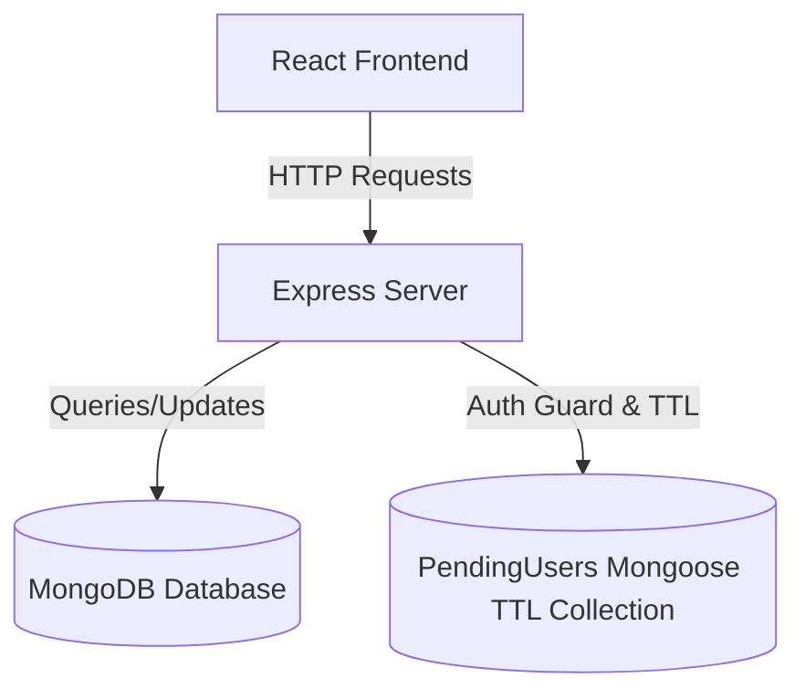
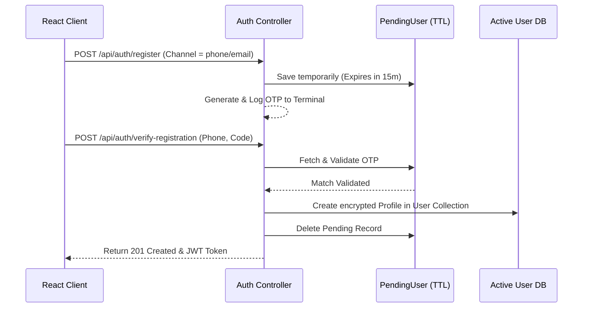

# MedEasy Web Platform – System & Codebase Documentation

This document provides a comprehensive, high-fidelity overview of the custom features, security guardrails, system integrations, and codebase modifications engineered on the **MedEasy Web Platform**.

---

## 🛠️ 1. Architecture & System Overview

The **MedEasy Web Platform** is built using a modern full-stack JavaScript architecture:
* **Frontend**: React (Vite client) styled with dynamic custom Vanilla CSS, utilizing React Bootstrap components, React Icons, and Chart.js dashboards.
* **Backend**: Node.js, Express, and Mongoose (MongoDB) database interface.
* **Session Management**: JsonWebToken (JWT) authentication, secure HTTP headers, and state persistence with localStorage.



---

## 🔒 2. Registration & Dynamic OTP Verification System

To prevent spam accounts and secure registrations, we engineered a state-of-the-art, dual-channel verification workspace.

### A. The Verification Database Flow
Users registers via the frontend, specifying their details and selecting a preferred `verificationChannel` (either `email` or `phone`). 

1. **Pending Registrations**: Registration details are stored securely in a temporary mongoose collection (`PendingUser`) using a **TTL index**.
2. **TTL Index (Automatic Cleanup)**: Accounts not verified within 15 minutes (900 seconds) are automatically expunged from the database by MongoDB background threads.
3. **Verification Code Execution & Dispatch**: A cryptographically random 6-digit OTP is generated. The platform dispatches this code as an HTML email via the **Resend HTTP API** (port 443) using the `RESEND_API_KEY` and `SENDER_EMAIL` environment variables. If these variables are not configured (e.g., in a local testing environment), the delivery agent executes a diagnostics fallback and outputs the code directly to the backend terminal console.
4. **Promotion to Active Users**: Once verified, the credentials are encrypted using bcrypt, saved into the active `User` collection, and the temporary `PendingUser` record is removed.



### B. Core Verification Backend Components

#### 📂 `backend/models/PendingUser.js`
Defines the schema for temporary registrants with automated deletion hooks.
```javascript
const mongoose = require('mongoose');

const pendingUserSchema = new mongoose.Schema({
  name: { type: String, required: true },
  email: { type: String },
  phone: { type: String, required: true },
  password: { type: String, required: true },
  role: { type: String, enum: ['patient', 'pharmacist', 'doctor', 'admin'], default: 'patient' },
  address: { type: String },
  verificationCode: { type: String, required: true },
  verificationCodeExpires: { type: Date, required: true },
  verificationChannel: { type: String, enum: ['email', 'phone'], required: true },
  createdAt: { type: Date, default: Date.now, expires: 900 } // TTL 15 Minutes
});
```

#### 📂 `backend/utils/verification.js`
Generates cryptographically random 6-digit verification codes and logs them in a clear diagnostic layout:
```javascript
function generateVerificationCode() {
  return Math.floor(100000 + Math.random() * 900000).toString();
}

function logVerificationCode({ method, identifier, code }) {
  const address = method === 'email' ? `email ${identifier}` : `phone ${identifier}`;
  console.log(`Verification code sent to ${address}: ${code}`);
}
```

#### 📂 `backend/utils/phone.js`
Normalizes Pakistani contact numbers (e.g. converting `03001234567` or `+923001234567` into a standardized format `923001234567`) to maintain database integrity:
```javascript
exports.normalizePhone = (phone) => {
  if (!phone) return null;
  let cleaned = phone.replace(/\D/g, '');
  if (cleaned.startsWith('00')) cleaned = cleaned.substring(2);
  if (cleaned.startsWith('03')) cleaned = '92' + cleaned.substring(1);
  if (cleaned.startsWith('3')) cleaned = '92' + cleaned;
  return cleaned.length === 12 && cleaned.startsWith('923') ? cleaned : null;
};
```

#### 📂 `backend/utils/mailer.js`
Handles sending verification codes and password recovery codes using the **Resend HTTP API** (avoiding outbound SMTP blockages on hosts like Render):
```javascript
exports.sendVerificationEmail = async (recipientEmail, otpCode) => {
  const resendApiKey = process.env.RESEND_API_KEY;
  const senderEmail = process.env.SENDER_EMAIL || 'onboarding@resend.dev';

  if (!resendApiKey) {
    console.log(`[Diagnostic Fallback] Resend API Key not set. Code for ${recipientEmail}: ${otpCode}`);
    return;
  }

  // Sends POST request to https://api.resend.com/emails with html body...
};
```

---

## 🛒 3. Platform Security Guardrails & Cart Synchronization

To guarantee that users do not interact with cart operations or leave orphaned checkout items in localized memory on session expiration:

### A. Login-Required Cart Modal
Unauthenticated users browsing the catalog are blocked from adding items to their cart. Instead of experiencing a silent failure or page redirection, the system triggers a beautiful, interactive **Login-Required Modal** (`LoginRequiredModal.jsx`). 
This prompts the user to either log in or quickly create a new account, informing them that their in-progress catalog selection will be fully preserved in the transition.

### B. Session State Cart Purge (`CartContext.jsx`)
To prevent session cross-contamination, a custom `useEffect` observer was built into the `CartProvider` workspace. 
When the authentication context states that `isAuthenticated` becomes `false` (e.g. manual logouts or token expirations), the shopping cart is instantly cleared and all local storage persistence caches are wiped clean:
```javascript
useEffect(() => {
  if (!isAuthenticated) {
    setCartItems([]);
  }
}, [isAuthenticated]);
```

---

## ⚡ 4. Dynamic Dashboard & Workspace Updates

### A. Professional User Personalized Greetings
Previously, dashboards welcomed users using their structural role strings (e.g., *"Welcome back, pharmacist"*). We refactored these layouts to access the authenticated user's actual registered name dynamically, maintaining structural fallback names for robust security:
```javascript
{/* Displays dynamic user names e.g. "Ahmed Apothecary" instead of raw role */}
<h2>Welcome back, {user?.name || 'Pharmacist'}!</h2>
```
This is fully configured and integrated into:
* **Doctor Dashboard (`DoctorDashboard.jsx`)**
* **Pharmacist Dashboard (`PharmacistDashboard.jsx`)**
* **Admin Dashboard (`AdminDashboard.jsx`)**

### B. Global Navbar & Admin Shortcuts Integration
To streamline the platform administrator experience, we moved direct management shortcuts up to the global top navigation bar while keeping them strictly hidden from standard users:

```
[ MedEasy Brand ]   [ Admin Dashboard ] [ User Management ] [ Verification Requests ]   [ User Toggle V ]
```

1. **Active URL Parameter State Synchronization**: We introduced a state-syncing pipeline using `useLocation()` inside `AdminDashboard.jsx` to dynamically swap active tabs on query string changes (`?tab=users` or `?tab=verifications`), preventing the need for full browser reloads.
2. **Sidebar Redundancy Cleanup (`hiddenFromSidebar`)**: To keep the admin layout extremely clean, the new top-navbar pages are filtered out from the side menu drawers. We introduced a `hiddenFromSidebar: true` metadata flag in the global `TABS` array:
   ```javascript
   const TABS = [
     { key: 'overview',      label: 'Dashboard Overview',   icon: <FaChartBar /> },
     { key: 'verifications', label: 'Verification Requests', icon: <FaUserCheck />, hiddenFromSidebar: true },
     { key: 'users',         label: 'User Management',       icon: <FaUsers />, hiddenFromSidebar: true },
     ...
   ];
   ```
   During layout rendering, hidden options are skipped:
   ```javascript
   TABS.filter(t => !t.hiddenFromSidebar).map(...)
   ```

### C. Fine-Tuned Top Navbar Active Highlights
* **The Bug**: Since the top navbar links all share the same base path (`/admin`), default routing matching highlighted all three admin links simultaneously, creating a glowing active box around all three items.
* **The Resolution**: Configured custom, query-based active checks inside `Navbar.jsx`:
  * **Admin Dashboard**: Marked active only when `pathname === '/admin'` AND `tab` is empty or `'overview'`.
  * **User Management**: Marked active only when `pathname === '/admin'` AND `tab === 'users'`.
  * **Verification Requests**: Marked active only when `pathname === '/admin'` AND `tab === 'verifications'`.
  This allows items to display their glowing active highlights only when currently selected, reverting to standard text highlights on `:hover`.

### D. MedEasy Brand Reload (Clear Memory Workspace)
When a logged-in provider (Admin, Doctor, or Pharmacist) clicks the `MedEasy` name on the top-left, the system performs a clean browser reload (`window.location.href`). This clears the transient React state, resetting the workspace dashboard and loading the **Dashboard Overview** fresh.

### E. Restored Appointment Oversight Date Engine
Fixed a runtime `ReferenceError` inside `AdminDashboard.jsx` by implementing the localized Pakistani date formatting utility `fmtDate` at the top of the scope, resolving the previous layout crash.

---

## 📁 5. Codebase Modifications Directory Index

Here is a full directory index of every component created or customized to construct this ecosystem:

### 1. Backend Core & Schemas
* 📂 [backend/models/PendingUser.js](file:///d:/Antigravity/Web%20Engineering/MedEasy/backend/models/PendingUser.js) – Mongoose collection schema for holding unverified registrants with active TTL indexing (15m expiration).
* 📂 [backend/models/User.js](file:///d:/Antigravity/Web%20Engineering/MedEasy/backend/models/User.js) – Modified properties to includePMC/PCP licensing, specialty fields, and verification status profiles.
* 📂 [backend/controllers/authController.js](file:///d:/Antigravity/Web%20Engineering/MedEasy/backend/controllers/authController.js) – Programmed registration flows, login verification steps, profile photo updates, and OTP checks.
* 📂 [backend/routes/auth.js](file:///d:/Antigravity/Web%20Engineering/MedEasy/backend/routes/auth.js) – API routers mapping verification and authentication controllers.
* 📂 [backend/utils/verification.js](file:///d:/Antigravity/Web%20Engineering/MedEasy/backend/utils/verification.js) – OTP generation and logging terminal toolkit.
* 📂 [backend/utils/phone.js](file:///d:/Antigravity/Web%20Engineering/MedEasy/backend/utils/phone.js) – Hashed string cleaning and phone normalization tools.
* 📂 [backend/utils/mailer.js](file:///d:/Antigravity/Web%20Engineering/MedEasy/backend/utils/mailer.js) – Sends transactional emails (verification OTPs and password recovery codes) using the Resend HTTP API over Port 443, complete with a terminal diagnostics fallback for local setups.

### 2. Frontend Components & Stylesheets
* 📂 [frontend/src/components/Navbar.jsx](file:///d:/Antigravity/Web%20Engineering/MedEasy/frontend/src/components/Navbar.jsx) – Configured Admin top-bar links, query active highlights, and custom logo click reloads.
* 📂 [frontend/src/components/Navbar.css](file:///d:/Antigravity/Web%20Engineering/MedEasy/frontend/src/components/Navbar.css) – Added stylish, premium custom hover animations for navigation buttons.
* 📂 [frontend/src/components/LoginRequiredModal.jsx](file:///d:/Antigravity/Web%20Engineering/MedEasy/frontend/src/components/LoginRequiredModal.jsx) – Login required overlay prompting guest catalog conversions.
* 📂 [frontend/src/components/LoginRequiredModal.css](file:///d:/Antigravity/Web%20Engineering/MedEasy/frontend/src/components/LoginRequiredModal.css) – Glassmorphic shading, customized panels, and smooth alert entry animation styles.

### 3. Context State Managers
* 📂 [frontend/src/context/AuthContext.jsx](file:///d:/Antigravity/Web%20Engineering/MedEasy/frontend/src/context/AuthContext.jsx) – Integrates server response data, verifies registration states, and passes active credentials.
* 📂 [frontend/src/context/AuthModalContext.jsx](file:///d:/Antigravity/Web%20Engineering/MedEasy/frontend/src/context/AuthModalContext.jsx) – State manager for toggling guest guardrail prompts.
* 📂 [frontend/src/context/CartContext.jsx](file:///d:/Antigravity/Web%20Engineering/MedEasy/frontend/src/context/CartContext.jsx) – Observes authentication flags and clears client-side memory states automatically on session logout.

### 4. Specialized Dashboard Modules
* 📂 [frontend/src/pages/AdminDashboard.jsx](file:///d:/Antigravity/Web%20Engineering/MedEasy/frontend/src/pages/AdminDashboard.jsx) – Dashboard tab views, verification request audit queue, modal tables, and dynamic routing updates.
* 📂 [frontend/src/pages/AdminDashboard.css](file:///d:/Antigravity/Web%20Engineering/MedEasy/frontend/src/pages/AdminDashboard.css) – Visual grids, badge styles, auditing cards, and list tables.
* 📂 [frontend/src/pages/DoctorDashboard.jsx](file:///d:/Antigravity/Web%20Engineering/MedEasy/frontend/src/pages/DoctorDashboard.jsx) & [frontend/src/pages/PharmacistDashboard.jsx](file:///d:/Antigravity/Web%20Engineering/MedEasy/frontend/src/pages/PharmacistDashboard.jsx) – Integrates dynamic, personalized username greetings and credential alerts.
